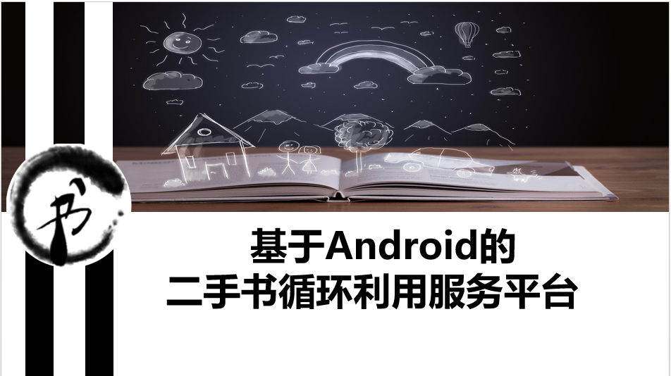

#shuwo书窝APP

###市场分析

一、在2015年Android手机操作系统中国市场份额达到72.8%，可见使用Android平台的可行性。
二、大家都知道我们国家每年纸张浪费是十分严重的，加上这些年来国家对低碳生活、节能减排的倡导，而我们这个平台恰好响应了国家的政策。
三、其实高校二手书获取渠道主要有校内义卖、书报亭、校外二手书店。但是他们都存在着短暂经营、公益性不强、服务范围狭窄、信息流通慢、书籍类别较少等问题。
当然，我们也进行了一些调查，调查显示：大部分同学获取书籍的方式为：网购，书店购买，学校发放。网购成为主要方式之一，这就是我们的着落点。29.46%的人选择将二手书当废品卖掉，11.61%的人选择直接扔掉，可见二手书处理方式上仍存在不够环保合理的方式。另一方面：有86.61%的人愿意使用二手书，74.11%的人愿意使用我们这样的服务平台。
另外，我们发现：
1.广州大学城内学生基数大，书籍需求量巨大，这是我们的潜力。
2.成熟的快递物流，高校间间隔不大，这给我们提供方便。
3．现在还没有一个较好的针对广州大学城的二手书服务平台。
所以，我们的服务范围是广州大学城内师生。可见我们的市场潜力是巨大的。

###功能模块

1.通过登陆,注册,第三方登陆,忘记密码,并且实行实名制制度来保障用户的交易安全。
2.首页。在首页可以发布二手书，并通过搜索，分类获取相关二手书信息，通过类似于淘宝的购物车，订单支付来进行买卖，租借，互换三种交易。并且可以对某种数进行评价，反馈交易信息。
 3.爱心板块。可以发布求书，捐书公告，给大家一个获取帮助或奉献爱心的平台。可以通过活动公告了解公益活动信息，参与活动；通过积分排行版查看用户信誉高低。
4.个人。根据个人需求进行提醒，设计了记录，钱包，积分，设置等模块，给用户提供人性化的服务,并且用户可以通过留言箱给我们提供建议和意见。
在后台管理上，我们对用户和二手书有关的信息进行审核，分析，更新，以保证后台运行的顺畅，从而保证能提供更好的服务。

我们在技术上主要运用Android的相关技术，并且借助Bmob移动后台和Ping++支付接口等实现运营成本的降低，以及更好的服务效果。

###风险与优势。

**在风险上**，我们面临着这样的问题：
1．	针对消费者贪新厌旧的心理，潜在用户其实不多。
2．	微信、网站、APP等众多的类似服务平台的竞争。
3．	实名制是否会被大家接受。
**在优势上**：
1．	上面我们已经分析过我们在大学城的市场是潜力巨大的，而我们大多数用户是大学生，对培养服务意识和环保意识的需求，促进我们服务平台的使用。
2．	我们在项目进行前对市场上类似功能的微信公众号、网站、APP进行了一个分析，公众号没有支付功能，网站包揽了书籍存储销售物流方面，比较复杂，并且缺乏公益性，APP大多只有买卖二手书的功能，没有租借、互换和捐赠求书等功能，所以我们这个平台针对他们的这些不足进行解决，在上面功能介绍中，我们有支付功能，我们有系统化，多样化二手书的处理方式，有公益活动公告、爱心捐赠求书来增加公益性，人性化相关服务，省去二手书存储、快递的繁杂，简化交易过程，让用户借助平台，获取信息，在保护隐私下完成交易。
3．	实名制是为了保证用户身份可信，进而防止在交易过程中出现难以解决的问题。并且我们有后台管理审核去保证，对用户信息的保密，我们还会与用户签订对二手书交易和价格等方面的协议，保证交易过程的合理性，以及后期通过学校相关证明来获得用户信任。
4．	我们的服务平台是纯公益，无获利，并且我们借助其他免费资源，平台几乎只需极低的技术成本。

